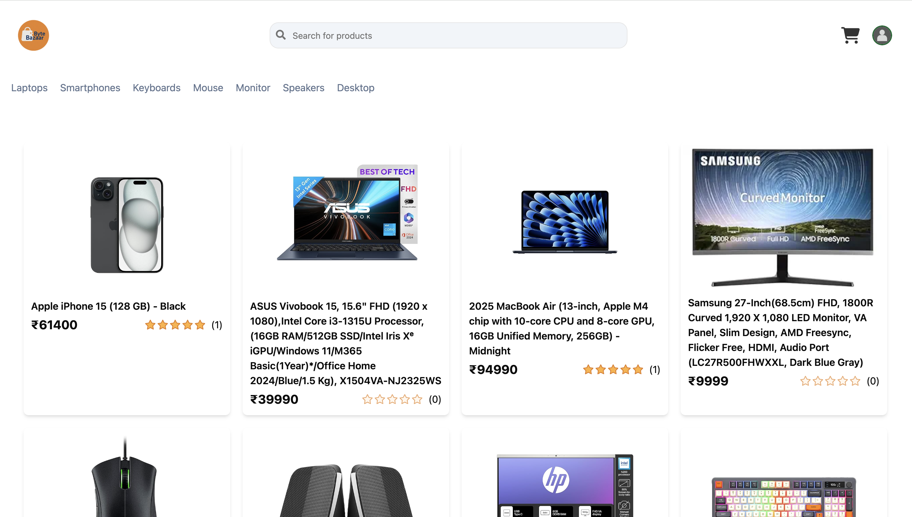
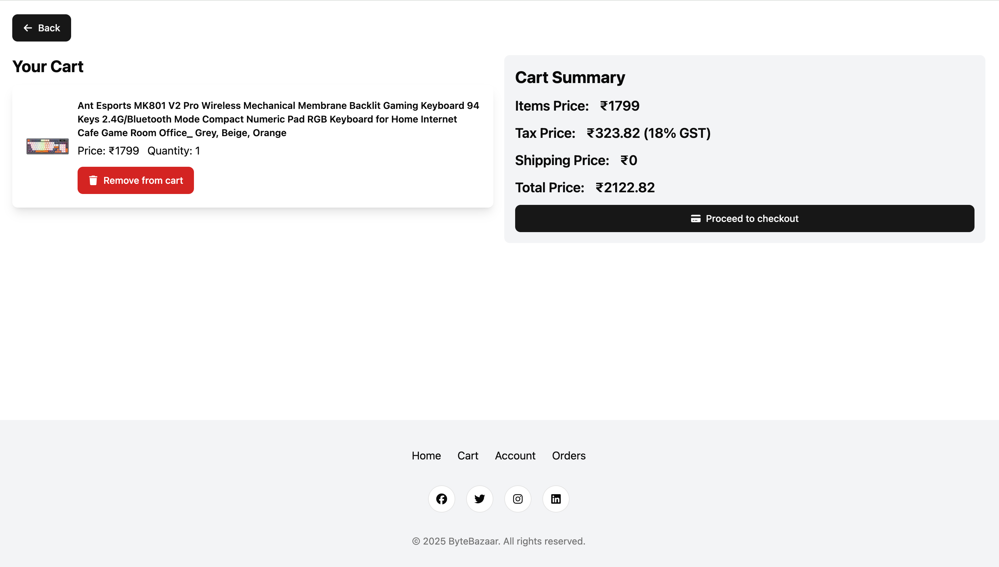
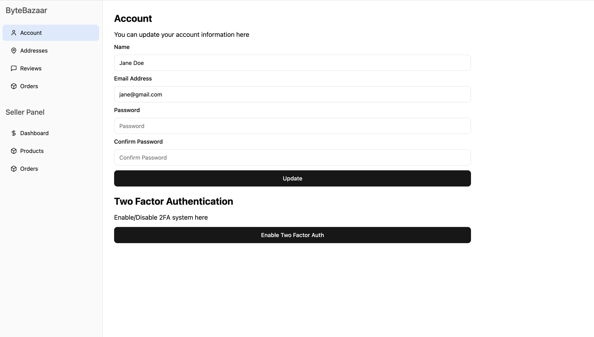
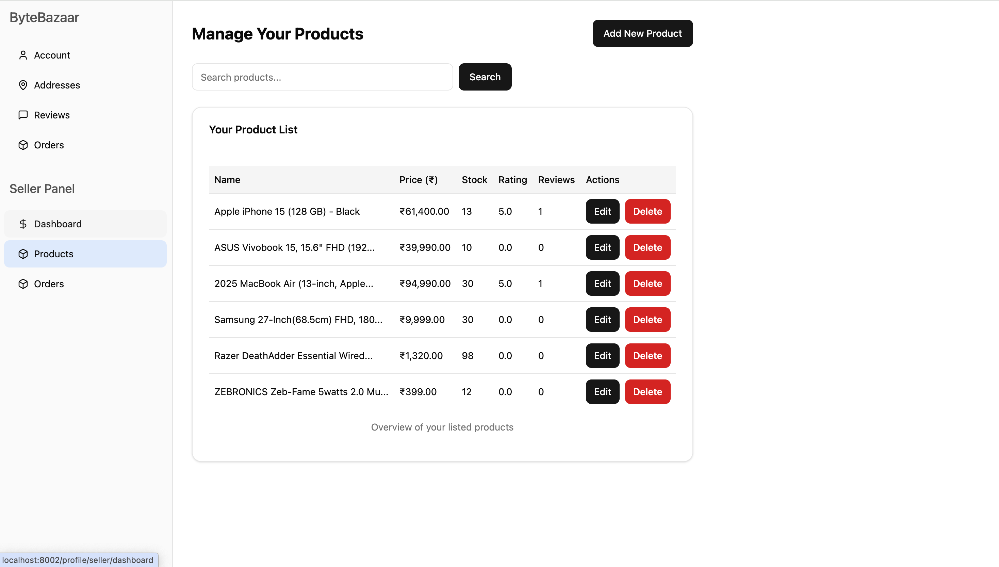
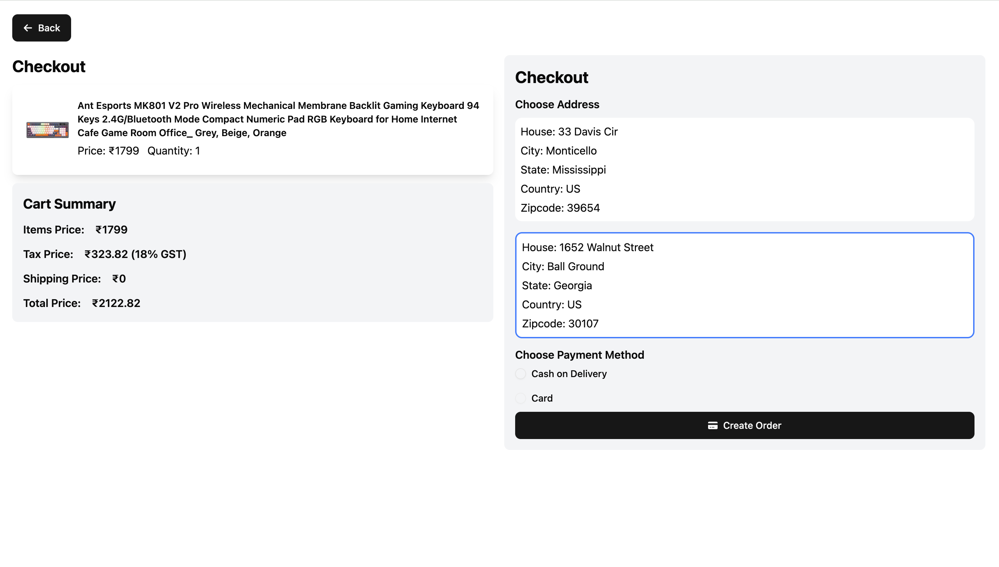
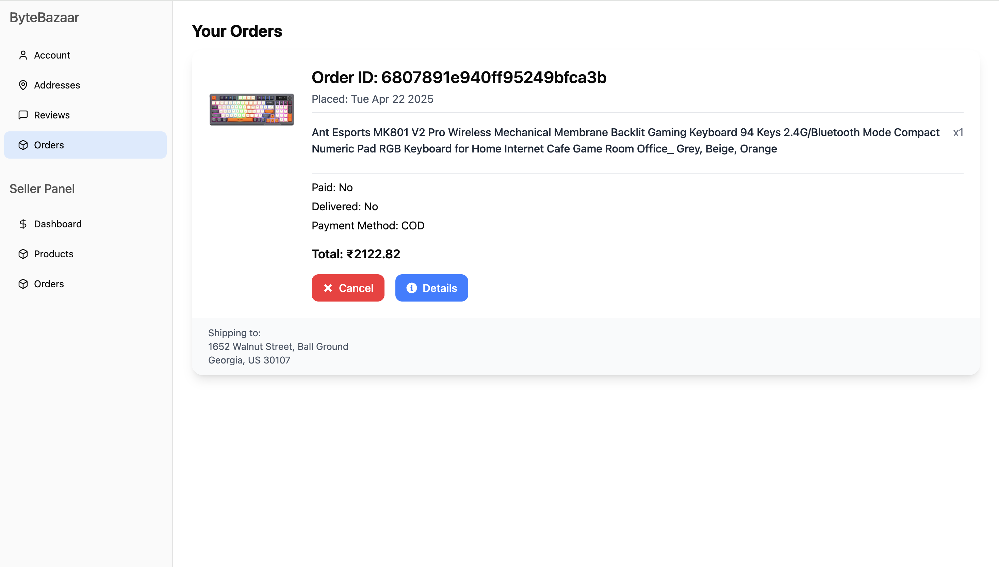
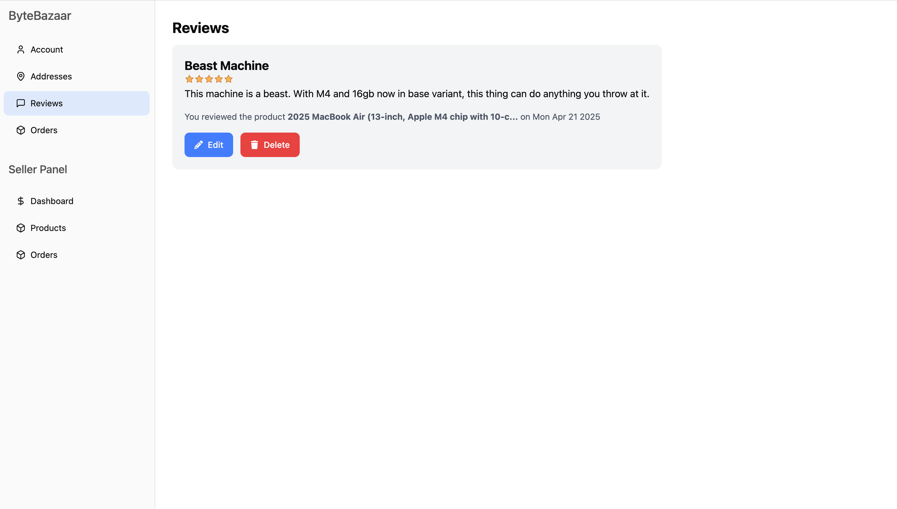
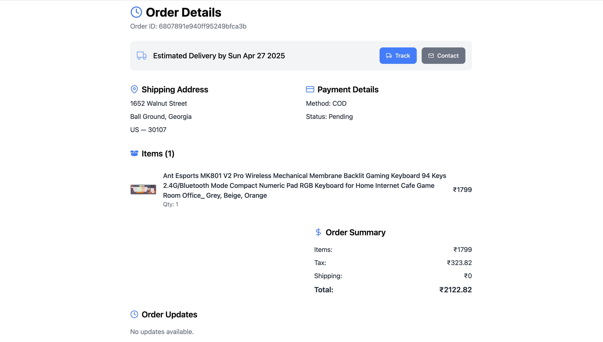
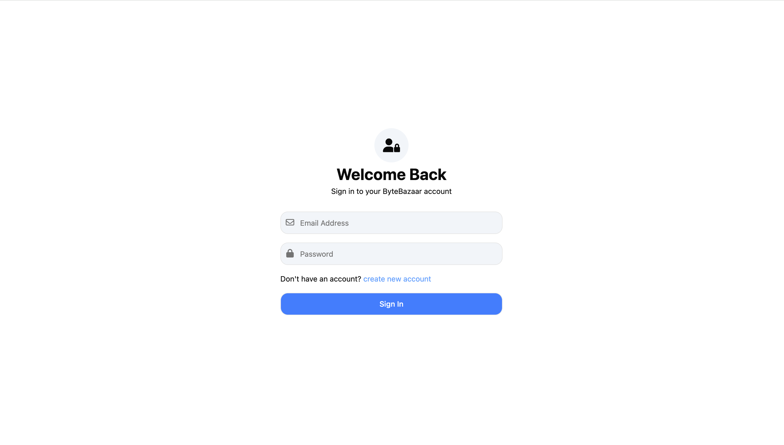

# Byte Bazaar — Full Stack E-Commerce Platform

Welcome to **Byte Bazaar** — a modern, scalable, and secure full-stack e-commerce platform built with **React**, **Node.js (Express)**, and **MongoDB**. This project delivers a complete, real-world online shopping experience including 🛍️ product browsing, 🛒 cart management, 🧾 order tracking, ✍️ reviews, and 🔐 secure authentication — with seller-specific dashboards and controls.

---

## 🚀 Features

### 📦 Backend (Node.js + Express + MongoDB)

- 🔐 **JWT-based Authentication & Authorization**
- 🛍️ **Product & Category Management**
- 🛒 **Shopping Cart & Orders API**
- 📤 **File Upload Support** (Multer)
- 🦺 **Security Middlewares:** Helmet, HPP, Rate Limiting
- 📊 **Request Logging** (morgan + winston)
- ⚙️ **Global Error Handling**
- 🧑‍💻 **Role-based Access Control** (Seller / Customer)
- 🗝️ **Password Reset Middleware**
- 📦 **Environment-based Config (dotenv)**

### 🎨 Frontend (React + Vite)

- 📱 **Responsive, Modular UI**
- 🧑‍💼 **Seller Dashboard & Product Management**
- 🛒 **Cart, Orders, Reviews, Address Management**
- 🏷️ **Category-based Filtering & Search**
- 🔐 **Protected Routes & Role-specific Views**
- 🎛️ **Reusable UI Components (Shadcn UI, Lucide Icons)**
- 📦 **State Management via Redux Toolkit**
- ⚡ **Vite for super-fast builds**

---

## 🛠️ Tech Stack

| Category  | Tools / Libraries                                  |
|:----------|:----------------------------------------------------|
| **Frontend** | React, Vite, Redux Toolkit, Shadcn UI, Lucide Icons |
| **Backend**  | Node.js, Express.js, MongoDB, dotenv, Multer, Helmet, HPP |
| **Authentication** | JWT (Access & Refresh Tokens) |
| **Logging**  | Morgan, Winston |

---

## 📂 Project Structure

```
├── backend
│   ├── controllers/       # API Controllers
│   ├── db/                # Database Connection
│   ├── middlewares/       # Custom Middlewares
│   ├── models/            # Mongoose Models
│   ├── routes/            # API Routes
│   ├── utils/             # Utility Functions
│   └── server.js          # Server Entry Point
├── frontend
│   ├── src/
│   │   ├── components/    # Reusable Components
│   │   ├── screens/       # Page Components
│   │   ├── slices/        # Redux Slices
│   │   ├── hooks/         # Custom Hooks
│   │   └── store.js       # Redux Store
├── logs/                  # Log Files
├── uploads/               # Uploaded Files
└── package.json
```

---

## ⚙️ Environment Variables

Rename `.env.sample` to `.env` inside your `backend/` directory and fill in the following fields:

```
NODE_ENV=development
PORT=8002
CORS_ORIGIN=*
MONGO_URI=<MONGODB URL>
ACCESS_TOKEN_SECRET=<access token>
ACCESS_TOKEN_EXPIRY=1d
REFRESH_TOKEN_SECRET=<refresh token>
REFRESH_TOKEN_EXPIRY=30d
```

### 🔑 Generate secure JWT secrets

```bash
node -e "console.log(require('crypto').randomBytes(32).toString('hex'))"
```

Paste the generated string into `ACCESS_TOKEN_SECRET` and `REFRESH_TOKEN_SECRET` for signing your JWTs.

✅ **Note:** Keep this file secret — never commit it!

---

## 📦 Install & Run Locally

Switch to `development` mode as per `NODE_ENV` in your `.env` file.

```bash
npm run build
npm run dev
```


> 🌐 Backend runs on: `http://localhost:8002`  
> 🌐 Frontend runs on: `http://localhost:5173`

### ⚙️ Production

```bash
npm run build
npm run server
```

---

## 📑 API Endpoints

| Method | Endpoint               | Description                   |
|:--------|:----------------------|:--------------------------------|
| `GET/POST/PUT/DELETE` | `/api/v1/users`         | User operations |
| `GET/POST/PUT/DELETE` | `/api/v1/products`      | Product management |
| `GET/POST/PUT/DELETE` | `/api/v1/category`      | Category management |
| `GET/POST/PUT/DELETE` | `/api/v1/cart`          | Cart operations |
| `GET/POST/PUT/DELETE` | `/api/v1/orders`        | Order management |
| `POST`               | `/api/v1/uploads`       | File uploads |

---

## 📖 Usage Highlights

- 🧑‍💼 **Sellers:**  
  - List products  
  - Manage inventory  
  - Track orders  
  - Update product details  
  - Seller-specific dashboard  

- 👤 **Customers:**  
  - Browse products  
  - Filter by category  
  - Add to cart  
  - Checkout orders  
  - Track orders  
  - Manage profile, addresses, and reviews  

- 🔐 **Security:**  
  - Password hashing  
  - JWT-based Access & Refresh Tokens  
  - API rate limiting  
  - Secure role-protected routes  
  - Secure file uploads  

---

## 📸 Screenshots

| 📱 Home Page | 🛒 Cart Page |
|:--------------------|:----------------|
|  |  |

| 👤 Profile Page | 🧑‍💼 Seller Products |
|:--------------------|:----------------|
|  |  |

| 👤 Checkout Page | 🧑‍💼 Orders Products |
|:--------------------|:----------------|
|  |  |

| 👤 Reviews Page | 🧑‍💼 Products Page |
|:--------------------|:----------------|
|  |  |

| 👤 Order Detail Page | 🧑‍💼 Login Page |
|:--------------------|:----------------|
|  |  |


---

## 📄 License

```
MIT License

Copyright (c) 2025 Manmeet Singh

Permission is hereby granted, free of charge, to any person obtaining a copy
of this software and associated documentation files (the "Software"), to deal
in the Software without restriction, including without limitation the rights
to use, copy, modify, merge, publish, distribute, sublicense, and/or sell
copies of the Software, and to permit persons to whom the Software is
furnished to do so, subject to the following conditions:

The above copyright notice and this permission notice shall be included in all
copies or substantial portions of the Software.

THE SOFTWARE IS PROVIDED "AS IS", WITHOUT WARRANTY OF ANY KIND, EXPRESS OR
IMPLIED, INCLUDING BUT NOT LIMITED TO THE WARRANTIES OF MERCHANTABILITY,
FITNESS FOR A PARTICULAR PURPOSE AND NONINFRINGEMENT. IN NO EVENT SHALL THE
AUTHORS OR COPYRIGHT HOLDERS BE LIABLE FOR ANY CLAIM, DAMAGES OR OTHER
LIABILITY, WHETHER IN AN ACTION OF CONTRACT, TORT OR OTHERWISE, ARISING FROM,
OUT OF OR IN CONNECTION WITH THE SOFTWARE OR THE USE OR OTHER DEALINGS IN THE
SOFTWARE.
```

This project is open-source — feel free to fork and improve it! 🚀
